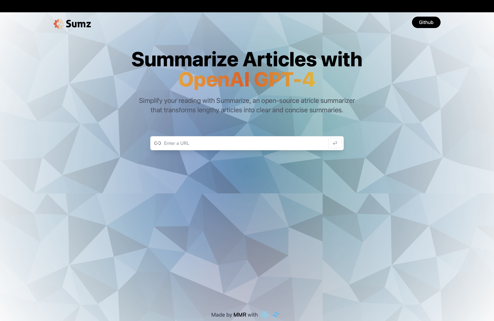

### Summarize

Summarize is an open-source article summarizer powered by OpenAI's GPT-4 technology. It simplifies lengthy articles into clear and concise summaries, enhancing reading efficiency and comprehension. This project documentation outlines the features, technology stack, and deployment details of Summarize.

---

#### About

Summarize is developed and maintained by [Your Name or Organization]. It was created with the goal of simplifying reading and enhancing information consumption. We hope Summarize proves to be a valuable tool for users seeking efficient access to information in the digital age.

---

#### Features

- **Article Summarization**: Summarize transforms lengthy articles into concise summaries.
- **Enhanced Reading Experience**: Users can quickly grasp the main points of an article without having to read the entire text.
- **OpenAI GPT-4 Integration**: Summarize leverages the cutting-edge GPT-4 model from OpenAI for accurate and coherent summarization.
- **Customizable**: Users can adjust summarization parameters to tailor the summaries to their preferences.
- **Responsive Design**: The web application is designed to be responsive, ensuring compatibility across various devices and screen sizes.

---

#### Technology Stack

- **Frontend**:
  - React: A JavaScript library for building user interfaces.
  - Tailwind CSS: A utility-first CSS framework for rapid UI development.
- **Backend**: (If applicable, specify any backend technologies used)
- **AI Model**: OpenAI GPT-4 (Rapidapi API library)
- **Deployment**: Vercel

---

#### Deployment

Summarize is deployed on Vercel, a cloud platform for static sites and serverless functions. Vercel provides seamless deployment and hosting for React applications, ensuring reliability and scalability. The deployment process is straightforward, allowing for quick updates and optimizations.

#### Live Link:

For a live demo, visit [Summarize Live Demo](https://summarizers.vercel.app).

To deploy Summarize:

1. Clone the repository from GitHub.
2. Install dependencies using npm or yarn.
3. Configure environment variables as necessary.
4. Connect the project to Vercel and deploy using the Vercel CLI or GitHub integration.
5. Monitor the deployment status and access the live application URL.

---

#### Contributing

Contributions to Summarize are welcome! Whether you want to suggest new features, report bugs, or submit code improvements, please follow these guidelines:

- Fork the repository and create a new branch for your changes.
- Commit your changes with descriptive messages.
- Open a pull request, explaining the purpose and impact of your changes.
- Participate in discussions and address feedback to ensure the quality of contributions.

---

#### Contact

For inquiries, feedback, or support, please contact the project maintainer(s) at [contact@musfikur.com](mailto:contact@musfikur.com).

---

#### Acknowledgements

Summarize acknowledges the following contributions and resources:

- OpenAI for providing the GPT-4 model.
- React and Tailwind CSS communities for their support and contributions.
- Vercel for hosting and deployment services.
- Contributors and users who have helped improve Summarize.

---

#### Screenshot:

